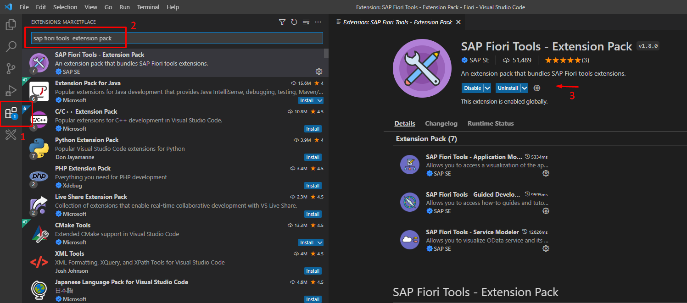

# Set Up SAP Fiori Tools in Your Development Environment
Set up your development environment and the extensions that enable SAP Fiori tools so that you can begin creating SAP Fiori apps in Visual Studio Code. 

## Prerequisites
- You must meet the minimum system requirements as described in [SAP Fiori tools documentation](https://help.sap.com/viewer/17d50220bcd848aa854c9c182d65b699/Latest/en-US/17efa217f7f34a9eba53d7b209ca4280.html)

## You will learn
- How to download Visual Studio Code
- How to download SAP Fiori tools from Microsoft's Visual Studio Marketplace

## Intro
SAP Fiori tools is an extension pack available for Visual Studio Code and SAP Business Application Studio that is designed to increase the efficiency of SAP Fiori elements app development. SAP Fiori is SAP's user experience, intended to provide end-users with apps that are role-based, adaptive, coherent, simple, and delightful. SAP Fiori elements provides predefined page types for SAP Fiori development, allowing users to quickly create SAPUI5 apps while taking advantage of the user interface provided by SAP. SAP Fiori tools allows users to easily generate SAP Fiori elements apps, modify the app's functionality, generate new pages, and preview the application with both backend and mock data.

To get started, this tutorial will introduce you to Visual Studio Code and explain how to download the required extensions from the Visual Studio Code Marketplace.

---

### Download Microsoft Visual Studio Code

To begin your set up, download Visual Studio Code from the Visual Studio Code website: <https://code.visualstudio.com/download>
>If you need additional support for getting started with Visual Studio Code, you can find more information here: <https://code.visualstudio.com/docs/setup/setup-overview>

### Get to know VSCode

If you have never used Visual Studio Code, it is advised that you familiarize yourself with it. If you have used it before, you may skip this step.

Here are some resources to help orient yourself with Visual Studio Code:

- [Visual Studio Code Basic Layout](https://code.visualstudio.com/docs/getstarted/userinterface#_basic-layout)

- [Visual Studio Code Introductory Videos](https://code.visualstudio.com/docs/getstarted/introvideos)

### Install SAP Fiori tools from VSCode Marketplace

Now that you have access to Visual Studio Code, you need to install the suite of SAP Fiori tools extensions. All the required/recommended extensions have been curated and bundled as part of a single extension pack, to allow easier and consistent download/installation.
>You can learn more about Visual Studio Code extension management here <https://code.visualstudio.com/docs/editor/extension-gallery>

In Visual Studio Code's **Activity Bar**, click the icon for extensions.

Next, clear the **Search Box** at the top of the **Extensions** view, type **`SAP Fiori tools`**, and then press **Enter**.

Click the extension called `SAP Fiori tools - Extensions Pack`, and then click **Install**.

>Once you install the Extension pack, it is recommended that you restart Visual Studio Code.