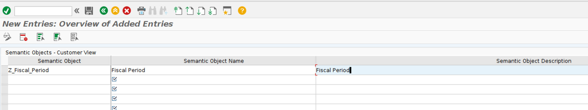
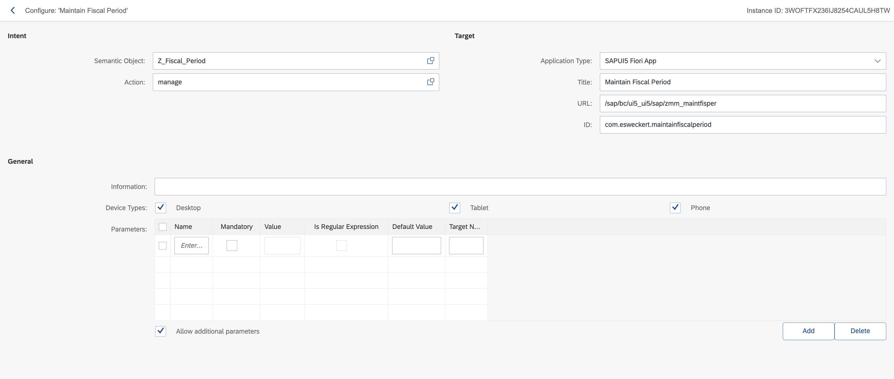
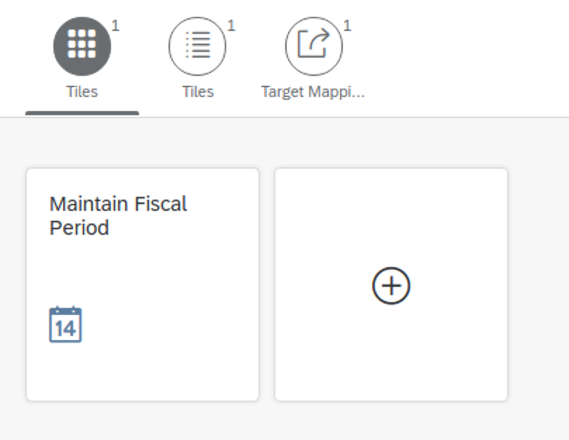
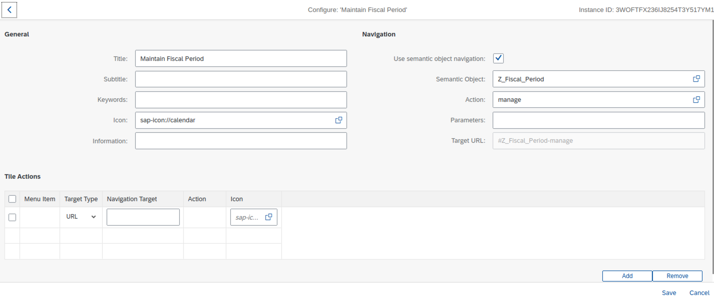
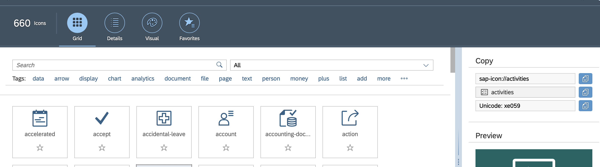

# Add a custom app to Fiori Launchpad

As custom apps do not have a reference catalog from where we can reference the apps in our own catalogs to access ui5 app in SAP-Fiori-Launchpad, below configurations needs to be done:
1. Semantic Object
2. Launchpad Role
3. Business Catalog
4. Business Group
5. App’s PFCG Role

## Create Semantic Object

**T-code:**   `/n/UI2/SEMOBJ`
The Semantic object is the link between ‘Business Tile‘ and ‘Target Mapping‘ within ‘Business/Technical Catalog’.

## Maintain Target Mapping

In the Fiori Launchpad Designer find your Technical Catalogue you want to add the app.
Go to Target Mapping and create a new navigation intend. **Note: Differently then stated in many Community Forum's DO NOT create navigation intends for SAPUI5 Apps using LPD_CUST anymore!!**

The base path URL of the app looks as follows e.g. `/sap/bc/ui5_ui5/sap/zmm_maintfisper` and consists of two items
    1. `/sap/bc/ui5_ui5/sap/` → this is the base path of the app in the Fiori Frontend Server (check transaction SICF)
    2. `zmm_maintfisper` → this is the name of the app in the ABAP repository 
The ID is the representation of the namespace used within the app, and as such a unique identifier. Multiple apps can not share the same namespace within one ABAP system.

## Create the tile

Create a new tile in the Fiori Launchpad Designer.

Configure your tile by adding the required informations. Choose the Semantic Object you have previously created together with the assigned Action. 

Use the SAP Icon Explorer to find an icon that fit's the purpose of your app. https://sapui5.hana.ondemand.com/sdk/test-resources/sap/m/demokit/iconExplorer/webapp/index.html#
Copy and Paste the Icon link into the "Icon" field.

## Add your app to the Business Group
Follow the instructions in the next tutorial [Create Fiori catalogues and groups](../create-launchpad-catalogs/README.md) to learn how to do that. 

