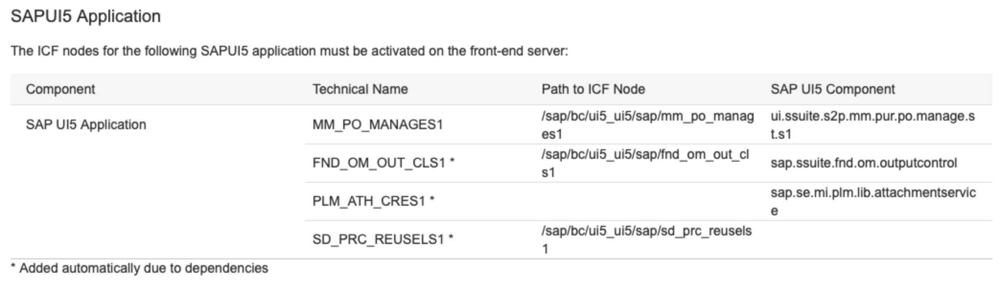
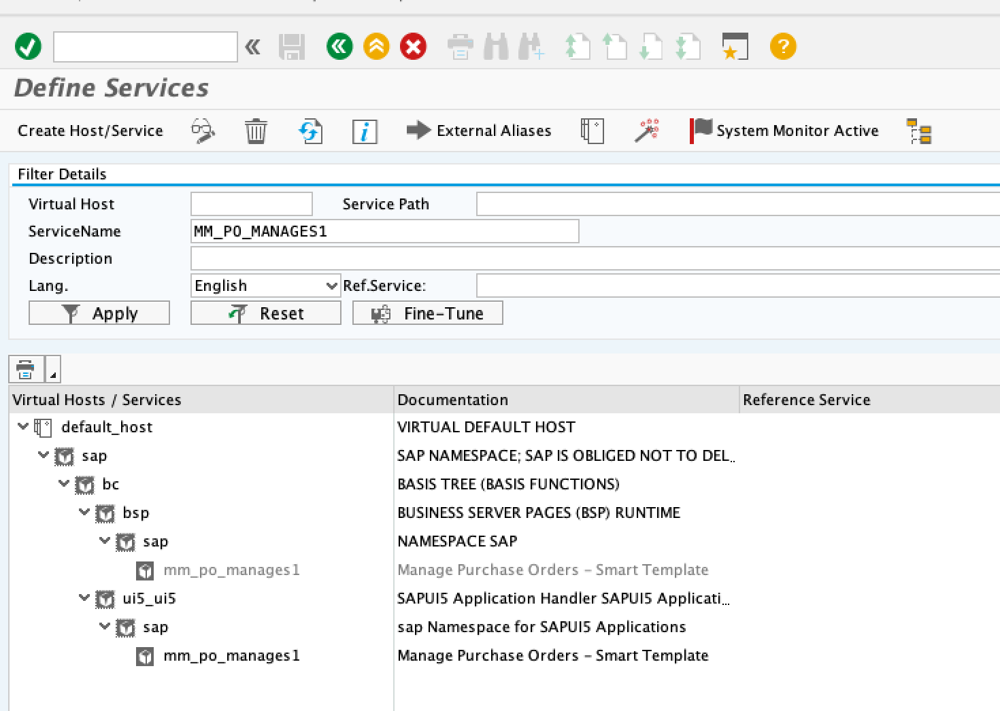
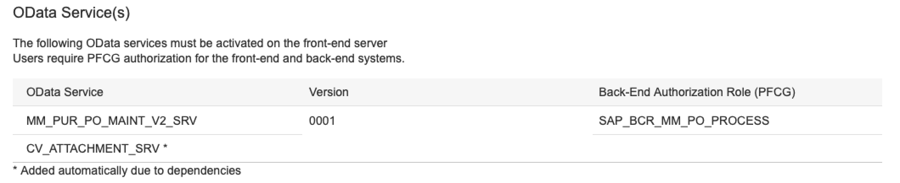
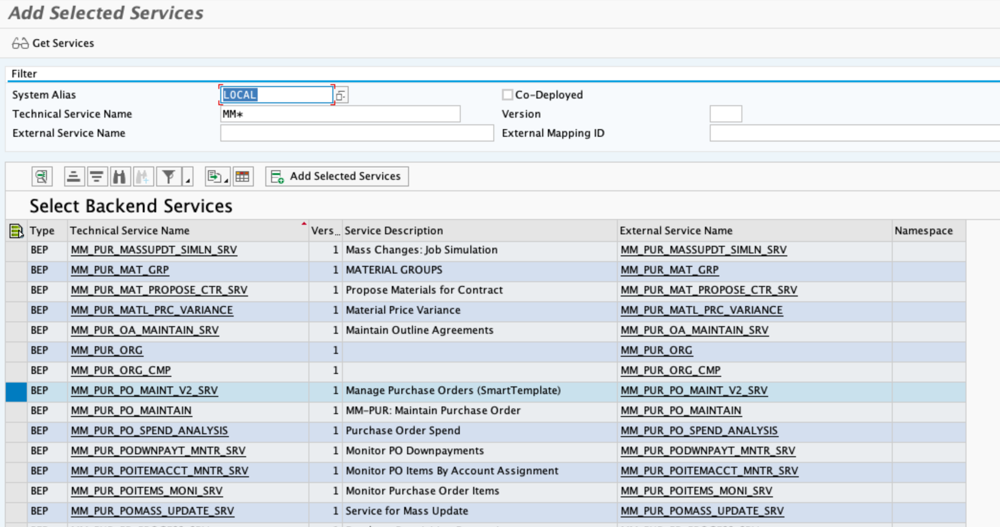
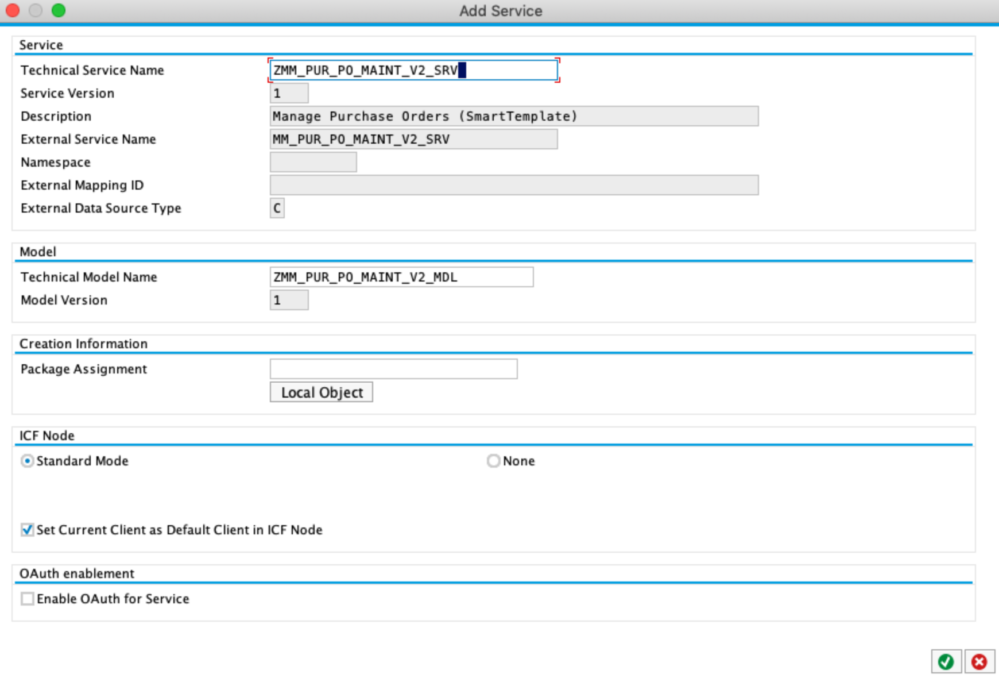
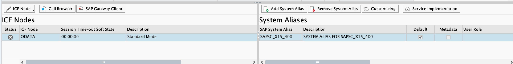
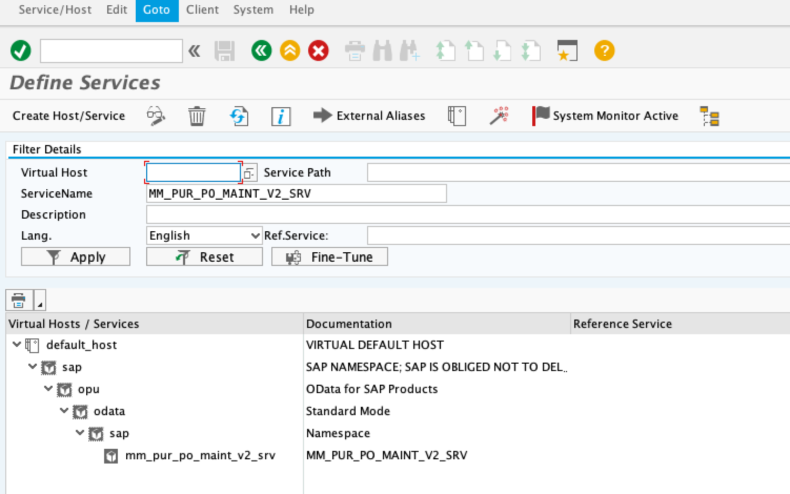
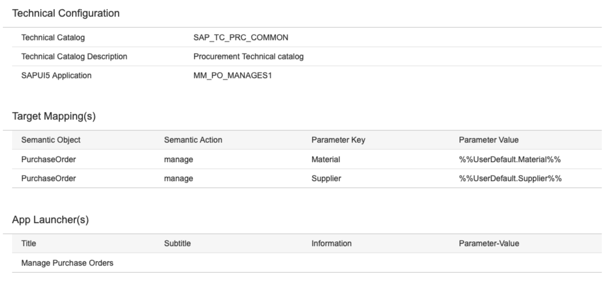
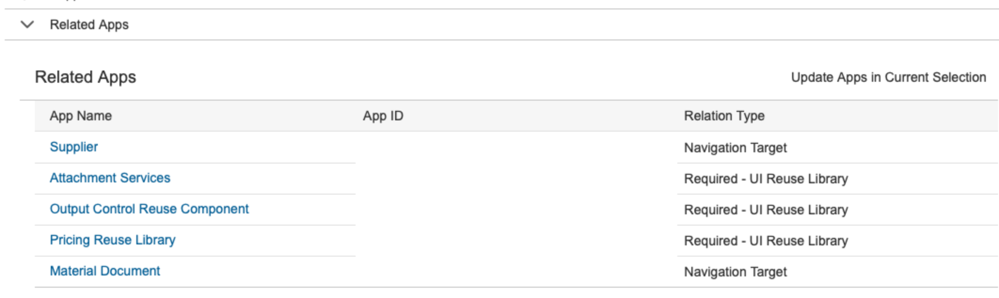

# Add a standard SAP Fiori App to the Fiori Launchpad

## Discover the Fiori App in the Fiori Apps Reference Library
Before starting implementing a standard SAP Fiori App, it is recommended to first identify all required pre-requisites as well as dependencies of that specific Fiori App. 
You do this in the SAP Fiori Apps Reference Library https://fioriappslibrary.hana.ondemand.com/sap/fix/externalViewer/#.

For the purpose of this guideline the App "Manage Purchase Orders" will be used throughout the document.
The Fiori App Reference Library will provide you with all informations required in the following steps to activate the app. 

## Create calaogues and groups

### What is a catalog?
A catalog is a set of Tiles / Applications you want to make available for one role. Depending on the role and the catalogs assigned to the role, users can browse through the catalogs and choose the Tiles / Applications that they want to display on the entry page of the SAP Fiori launchpad.

### What is a group?
A group is a subset of Applications from one or more catalogs. Which tiles are displayed on a user’s Home page depends on the groups assigned to the user’s role. In addition, the user can personalize the entry Fiori Page by adding or removing Applications to pre-delivered groups or self-defined groups.

:point_right: Check out the [Tutorial](../create-launchpad-catalogs/README.md) how to create catalog and groups.

## Configurate and activate a standard Fiori App

| Step | Example / Screenshot | Steps / Description |
|------|----------------------|---------------------|
| 1 |  | The section "Configuration" contains the informations required to customize and activate the Fiori App on the Backend and Front-End. SAPUI5 Application contains all ICF nodes required by the Fiori App including its dependencies, in our example for "Manage Purchase Orders" and need to be activated. <ul><li>MM_PO_MANAGES1 → The App itself </li> <li>FND_OM_OUT_CLS1 → Output control </li> <li>PLM_ATH_CRES1 → Service used to upload attachments </li><li>SD_PRC_REUSELS1 → Re-use component (shared between many apps)</li></ul> |
| 2 |  | Activate the above identified services as following: <ol><li> Go to transaction SICF → Enter the service name(s) from the previous step and click execute</li><li>Activate the respective service with right click on the service, choosing "ActivateService"</li><li>Repeat the steps for all Services identified in step 1.</li></ol> |
| 3 |  | The OData Service(s) section contains all OData Services that need to be added. The provide the data to SAP Fiori App and control via PFCG which data the user can see. You can activate those services using transaction IWFND/MAINT_SERVICE.  For our example app this are following services:<ul><li>MM_PUR_PO_MAINT_V2_SRV</li><li>CV_ATTACHMENT_SRV</li></ul> |
| 4 |        | <ol><li>Go to transaction IWFND/MAINT_SERVICE and select "Add Service"</li><li>Add the System Alias from which the service should be added. On our embedded Fiori the System Alias will be LOCAL. </li><li>Enter the technical Service name, in our case MM_PUR_PO_MAINT_V2_SRV</li><li>select the service and click "Add selected Services"</li><li>On the next screen, enter a package. In our case ZSCE. Leave all other default values. By clicking confirm you will be asked to provide a Workbench TR to.</li><li>Return to the main Screen to "Activate and Maintain Services". Select the just added Service, in our case ZMM_PUR_PO_MAINT_V2_SRV.</li><li>On the bottom, go to ICF Nodes, select the node and activate it.</li><li>Ensure that the service has a system alias assigned. In case its missing add it.</li></ol> |
| 5 |  | <ol><li>Go to transaction SICF → Enter the ServiceName(s) from the previous step and click execute.</li><li>Activate the respective service with right click on the service, choosing "ActivateService"</li><li>Repeat the steps for all OData Services identified in step 7.</li></ol> |
| 6 |  | For SAP Standard Fiori Apps no specific customising is needed as the pre-configured settings can be re-used. <ul><li>Technical configuration - includes informations about the Technical Catalog and its description in Fiori Launchpad</li><li>Target Mappings - includes semantics required for the app to function. This is also done on Fiori Front-End Server</li></li>App Launcher - Contains descriptive informations that the user will see on the tile in Fiori Launchpad</li></ul> For own developments, in the Target Mapping, you define the URL of the application to be launched when user clicks a tile. |
| 7 |  | **Related apps are necessary to allow the user navigation or drilldown to supporting informations. In case of our example "Manage Purchase Orders" this would be** <ul><li>Display of Supplier Informations</li><li>Display of respective material documents</li></ul>Be advised to always check this section, as even if there is no app to app navigation, it is still possible to have the requirement to pre-configure UI Reuse library for certain informations/items. In our example this would be:<ul><li>Attachment service → to allow attaching documents to the PO</li><li>Output control reuse component</li><li>Pricing reuse library → needed to display pricing/calculation data</li></ul> |
| 8 |           | If related apps are required for your app, like in our example, repeat the steps 01 - 07. |
| 9 |           | Once done with the configuration we continue adding the apps to the required Catalogues and Groups. |
