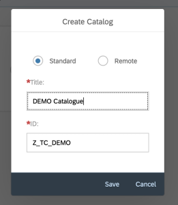
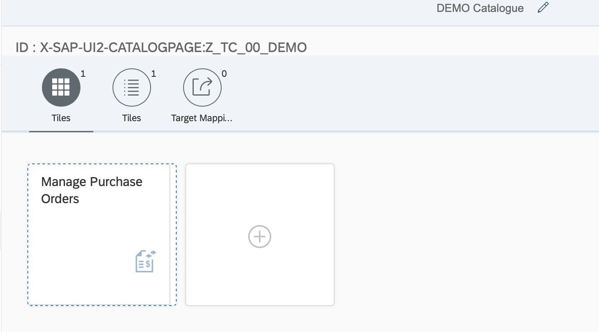
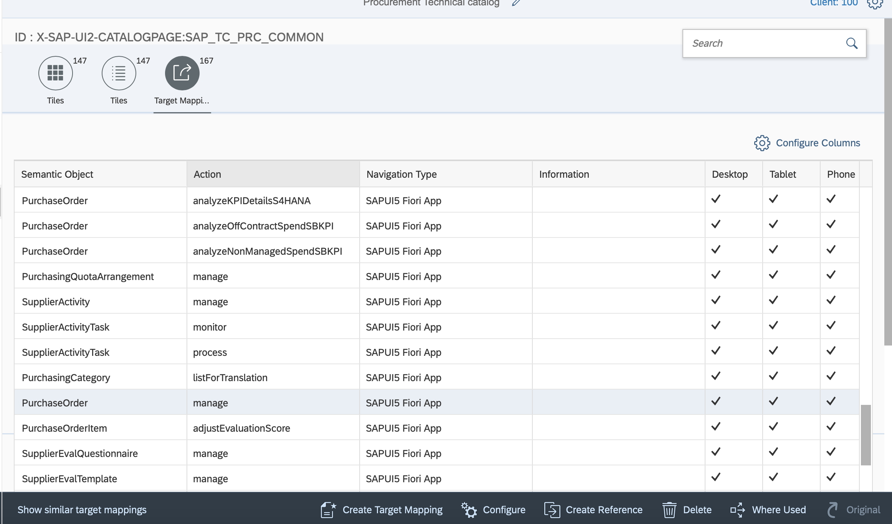
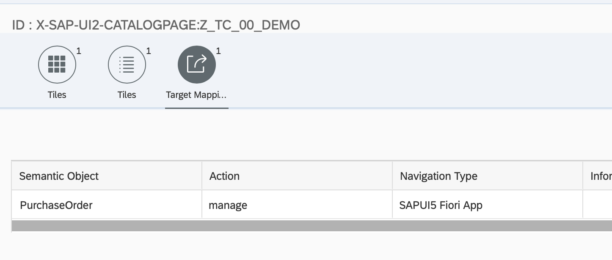
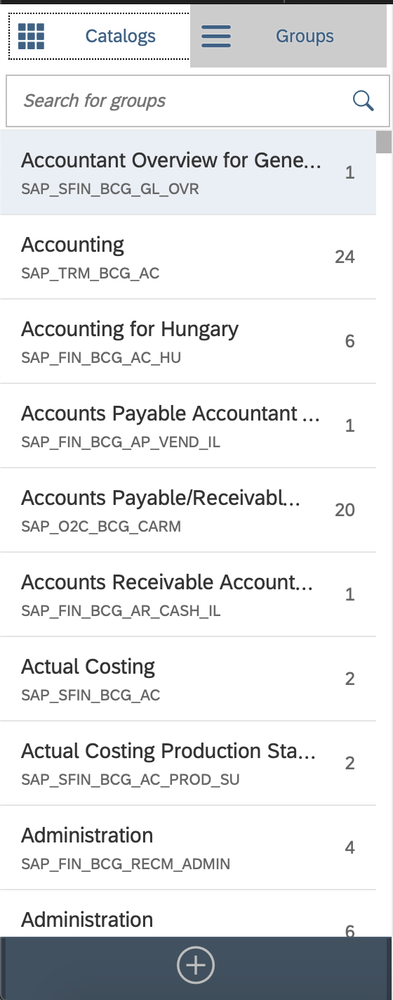
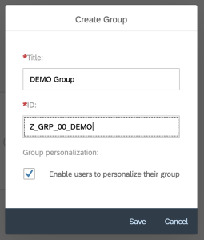
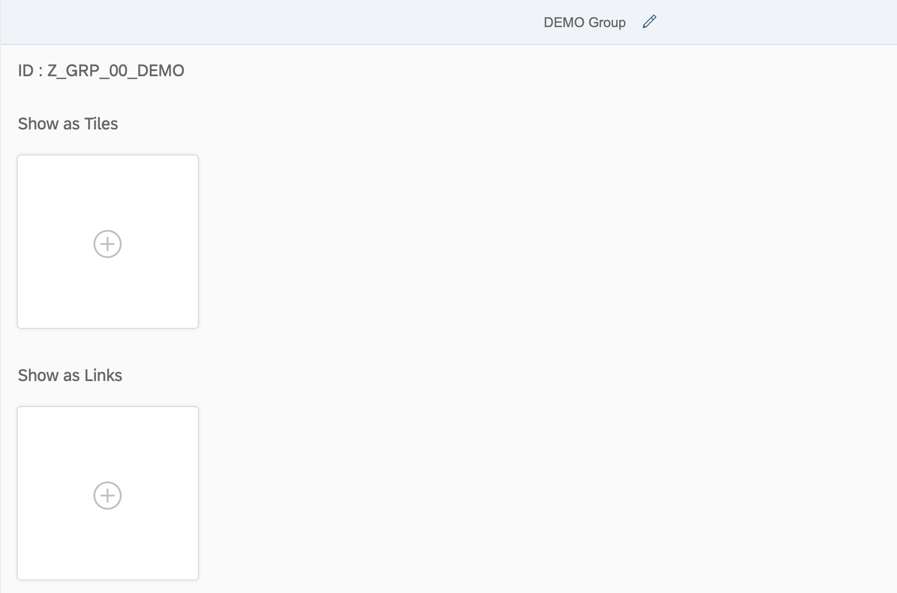
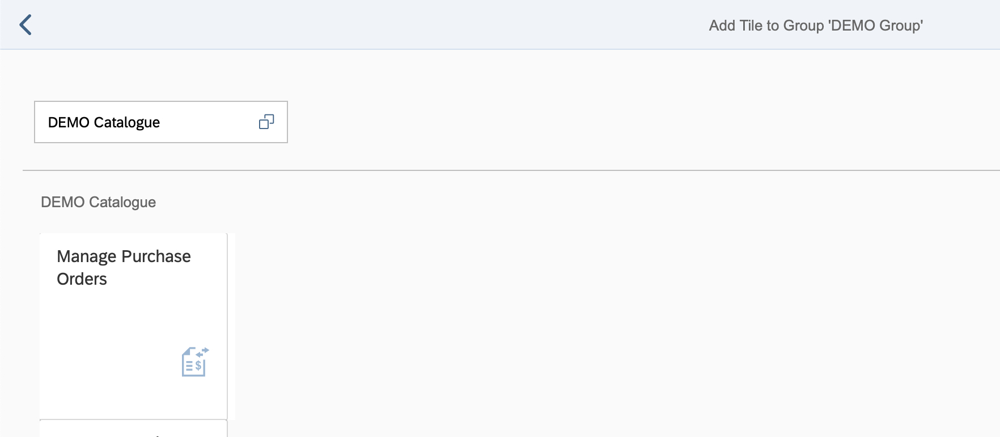
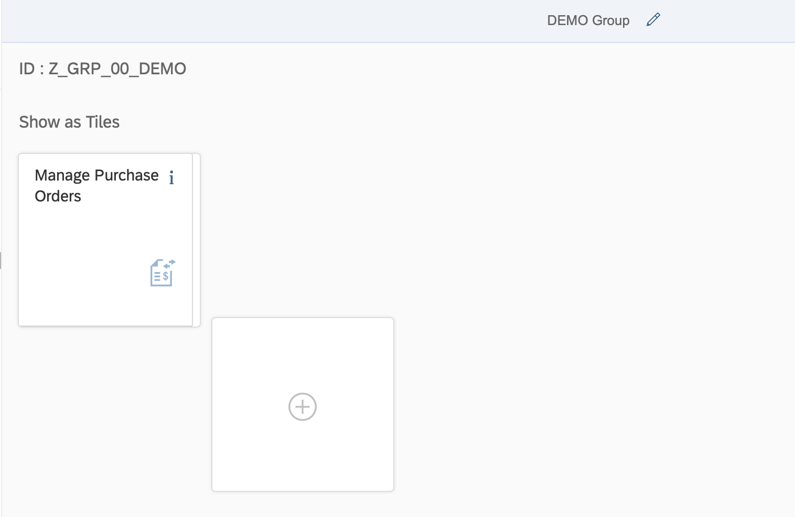

## Create Fiori catalogues and groups

# Step 1: Access the SAP Fiori Launchpad Designer
`https://sapxx.your-domain.com:4431/sap/bc/ui5_ui5/sap/arsrvc_upb_admn/main.html`

# Step 2: Create a new catalog 
Click `+` to create a new catalogue and give it a name and title. That's all.

# Step 3: Add a previously activated standard SAP Fiori App to your catalogue

Once we have activated our Fiori App with all necessary services, we can use the Standard SAP Catalogue which will fulfill our requirement (if you don't remember the standard catalogue name, look it up in the Fiori App reference library).

Once you select the catalogue, it's tiles / apps will be displayed on the right side. Search for the App you want to add to your catalogue. Select the required app/tile and hold it. On the top of the screen you will see 2 options appearing on the top of the screen → 1. Create reference and 2. Delete 

Drag your app/tile to option "Create reference". On the next pop-up you are able to select your previously created catalogue. Now we have a reference to the standard app in our own catalogue.

Once the tile/app has been added to our catalogue we need to create the target mapping for the app. Target mappings referencing the actual navigation targets to SAPUI5 apps defined on the SAP Frontend Server. 

To avoid creating the target mapping manually we again make use of the reference data from the standard sap catalogue.

Navigate to the SAP Standard Catalog (in our demo case this is SAP_TC_PRC_COMMON). Click on target mapping and find the semantic object used by your app (remember: you can find this informations in the Fiori apps reference library). 

Select it and click "Create Reference". Select your catalogue and click "Save". 

In your previously created catalogue you can now see that the target mapping has been created from the reference.

## Create Group
# Step 1: Create a business group

Business Groups are created in a similar way like catalogues. 

Click on "Create" and give you Group a Title and an ID based on our agreed naming convention. Click "Save" to save your Group.

# Step 2: Assign the App to the business group

As you know, a Group is a subset of tiles/apps that we want a specific user group to see once the launch the SAP Fiori Launchpad.

We have two options to display apps to our users a) as tile and b) as link. We want to show apps to users as tiles. 

On the next screen we see our previously created catalogue including the added app. Select it to add it to our group. We can also add other Apps/tiles from other Catalogs by searching in the search bar.

Now you can see that our app has been added from our catalogue to the newly created group.
With this we completed the creation of the catalogue and group. To grant the user access to the catalogue and the assigned apps, both (the catalogue and the group) need to be added to the respective pfcg roles. 