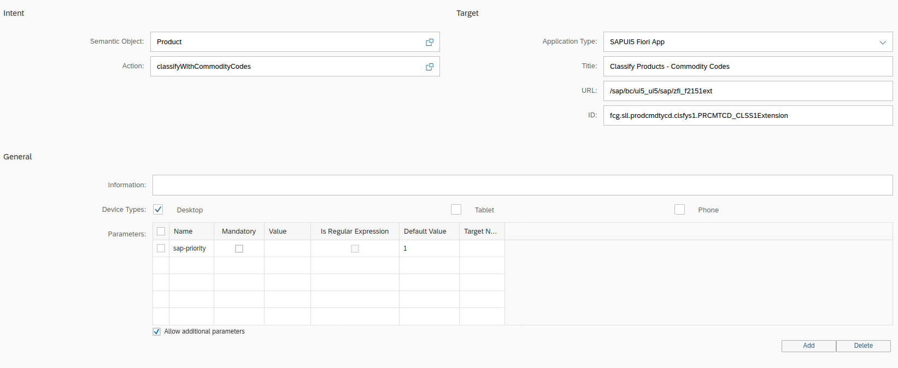

# Tile configuration for app extensions

With SAPUI5 we have in many cases the possibility to extend standard apps to our specific requirements. In most cases we do this by using SAPUI5 flexibility or component configuration. 

**SAPUI5 flexibility** is the preferred way to extend SAP Fiori elements-based apps.

**Component configuration** is based on merge and supports only override of methods. 

As both methods are layered controller extensions, we need to do adjustments the Fiori Launchpad as every extension results in its own Z*-BSP element in the backend and in return the standard tile needs to point to this new Z-BSP instead.

## Create a new target mapping

For the standard tile to point to the extension, create a new target mapping in the catalogue of your app. Change the BSP Url to point to the new app you created (extension app) and the corresponding ID.

The Url to the extension as well as the ID (aka: Namespace) you'll receive from the developer who did the enhancements.

For this example let's assume we have extend the standard fiori app `Classify Product`

And then there is the :fire: main trick: add a new parameter `"sap-priority"` with default value **"1"**. This parameter makes sure that this is the default target for the semantic object and action.

> [!IMPORTANT]
Very important: in order to route to the new extension, the semantic object and the action need to be the same as the original app. Only then the original app will be replaced with the extension.