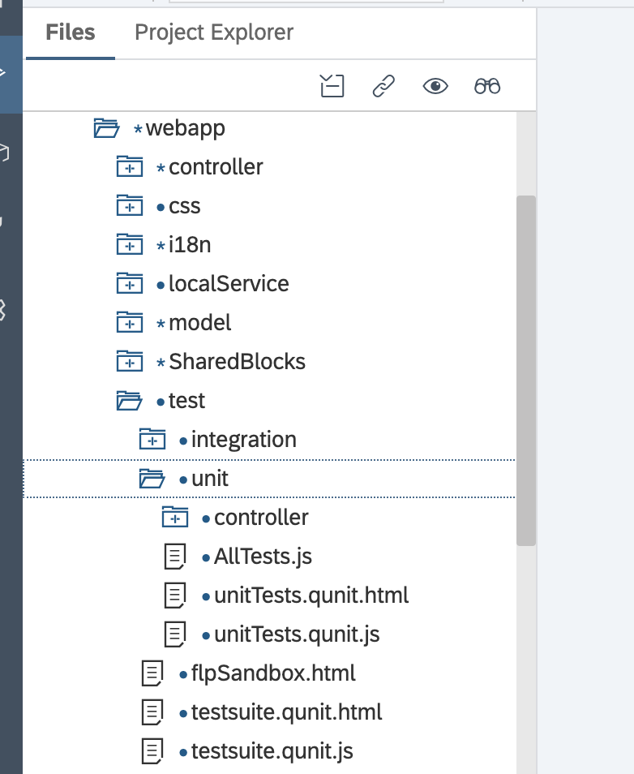
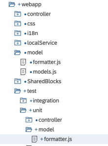
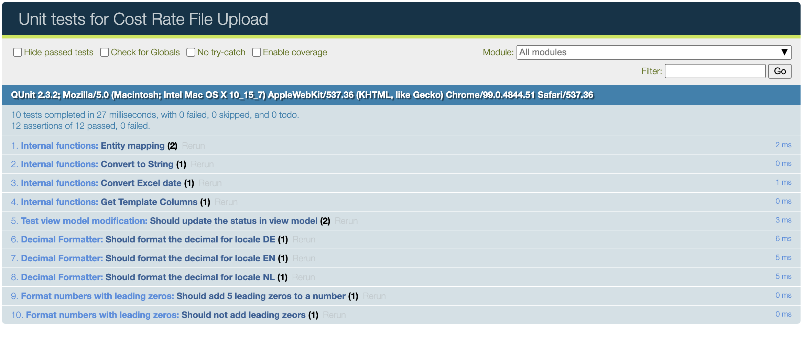

# Unit testing with SAPUI5

## Introduction

The aim of this document is to provide a guideline on the main steps to be performed setup and create Unit Tests, to gain a general understanding of how to work with the SAPUI5 Testing Framework as well as its pre-requisites.

## Unit Testing using QUnit

In this section, we’ll start with how to set up unit testing with QUnit, the unit testing framework included with SAPUI5. All the examples shown in this tutorial are based on a random Demo App. In terms of approach, unit testing in SAPUI5 will mostly be concerned about the following:
- Test all the public functions you introduced.
- Test all the overwritten getters and setters.
- Test your control's events and how often they are called.
- Test all possible user interactions (tap, keyboard, focus).
- You could test how often your control gets rerendered when interacting with it, but only if you are worried that it might be rerenderd too often or not at all.
- Write some integration tests if you have a composite control (don't cover 100% of your child controls - that's overkill and child controls will be hard to maintain).
- You may test default values of properties, since we cannot change them backwards compatible and a test will recognize this.
- Test how your control interacts with models (OData + Json).
- Test the destruction of your control when working with composites, test if all dependencies/events are unbound on destruction.

## QUnit
SAPUI5 uses QUnit for unit testing, and QUnit is the JavaScript language xUnit framework. QUnit includes a number of standard features—the test runner, test suite, and test case—that make testing convenient.
A test runner is an executable program that runs a collection of one or more test suites and then reports the test results in an easy to read format. The test suite itself is a collection of one or more test cases. The most elemental unit, a test suite, will also share the same test fixture, which is a set of conditions that have to exist in order for the tests to be successful. If for example you are testing whether the address of a purchase order is well-formed, you will need to create a purchase order and would do so in a test fixture.

### Setup
> [!NOTE]
Before you begin setting up a QUnit test environment and your are not yet familiar with QUnit, you can find an introduction to the QUnit test API here: http://api.qunitjs.com/. This official QUnit documentation features a complete description of the QUnit test API and contains many examples.

Below you can see the typical unit test structure within a SAPUI5 project. Should you be using SAP WebIDE this structure will be automatically generated upon project creation. Developers using a local IDE (like Visual Studio Code) need to setup the testing environment locally, typically either via nom or by cloning the respective app templates from Github. In this tutorial I'll be covering unit test creation with SAP WebIDE. I'll be creating an additional tutorial about SAPUI5 development with Visual Studio Code soon, where I'll be covering the topic of Unit Test setup as well.



All unit tests are located in the webapp/test/unit folder and can be started by calling unitTest.qunit.html, an HTML page that is a QUnit runner that calls all unit tests of the app and displays the test results in a readable format.
The qunitTests.qunit.html begins by defining the location of the production and testing code, the QUnit (and sinon) libraries, and then the file that contains all the actual tests themselves. SAP provides additional libraries that seamlessly connect SAPUI5 and QUnit. Essentially, unitTests.qunit.js serves as a simple aggregation point, as shown below:

```js
/* global QUnit */
QUnit.config.autostart = false;
sap.ui.getCore().attachInit(function () {
"use strict";
sap.ui.require([
"com/esweckert/crufileupload/test/unit/AllTests"
], function () {
QUnit.start();
});
});
```

unitTests.qunit.js in turn calls AllTests.js, which references the individual modules (test suites). Although it might seem a bit confusing and inefficient having so much dereferencing, but the the advantage of separating the files in this manner is that multiperson teams can develop the modules separately and begin with empty files (in support of the test-driven development approach).

> [!NOTE]
Test Driven Development (TDD) is a software development model that relies on a very short development cycle. When using TDD a developer first writes a failing automatic test case to describe the behavior of a new feature or functionality. As soon as the test fails (due to the still missing implementation) the role of the developer switches to the implementation. The code is added to make the test run successful and then the cycle starts over again.
There might also be iterations where just the implementation or testing code is refactored to make it more elegant. TDD reduces complexity while maintaining high test coverage of the application coding at the same time.

***Test suites and test cases***

The QUnit test suite and test case are implemented with the following function calls:

***QUnit.module(string)***

Defines a module, or test suite, which is a grouping of one or more tests.

***QUnit.test(string, function)***

Defines a test case.

With the test module and individual test defined, we’re ready to create the tests themselves. Tests are primarily organized around “assertions.
Each test case includes at least one assertion that we seek to demonstrate to prove the correct execution of some aspect of the application. An assertion is implemented as a function and expresses a logical condition, like equals. If the assertion is not met, the QUnit framework throws an exception and stops the execution of that test.

For SAPUI5, we’ll use a combination of the following QUnit assertions in our Unit Tests to show our code is working properly:

***assert.ok(boolean, string)***

Asserts that the provided value casts to boolean true. The string is used to identify the assertion that was made.

***assert.equal(value1, value2, message)***

Compares two values, using the double-equal operator. The message is used to identify the assertion that was made.

***assert.strictEqual(value1, value2, message)***

Strictly compares two values, using the triple-equal operator. The message is used to identify the assertion that was made.

**assert.deepEqual(value1, value2, message)**

Compares two values based on their content, not just their identity. The message is used to identify the assertion that was made.

### Mocking and stubbing

As we want for our automated tests to be repeatable, and to enable automated testing—especially repeatability—some specific technologies are required: stubs, mocks, and spies. QUnit includes all of these capabilities.

**Stubs**

A stub is code used simulate the behavior of existing code. Typically a stub is used for complex code or as a temporary substitute for yet-to-be-developed code.
We will focus on two cases for using stubs (from https://sinonjs.org/releases/v13/stubs/):

1. Control a method’s behavior from a test to force the code down a specific path. Examples include forcing a method to throw an error in order to test error handling.

2. When you want to prevent a specific method from being called directly (possibly because it triggers undesired behavior, such as an XMLHttpRequest or similar). A QUnit stub looks like: `var oStub = sinon.stub(function, “method”)`, which replaces the call to object.method with the stub. In normal practice, the oStub object is then called with methods like `throws()` or `withArgs().returns()` to force a particular situation. Make sure that the method is unstubbed to avoid difficult to identify errors in follow-on testing!

**Spies**

A spy is used to confirm that a function was actually called, or that the function was called with certain parameters. Our application does not make use of spies, but if we wanted to determine if a specific credit card handling function was called based on the user’s input, we could use a spy. The method called to attach a spy to an object or method is similar to the stub call: `var oSpy = sinon.spy(function, “method”)`. Again, the oSpy object is then called with methods like `called()` or `calledWith()` to determine if the method was called or if the method was called with specific arguments.

**Mocks**

Mocks are objects that simulate the behavior of another object. The difference between a stub and a mock is really more scope than definition. If you would use a stub, but there is more than one specific behavior to test, a mock may be more appropriate.
Our application, as is the case with most SAPUI5 applications, makes extensive use of a mock server, including the use of predefined data to return predictable items from our calls to the data store, without requiring that the data store exists. 

### Creating the first test case

We want to start writing test cases for our implemented formatter functions. Therefore we create a test a new file in folder `test/unit/model/`. It is common practice to put unit tests in a similar folder structure and get the same name as the artifact that is tested.



Our formatter used in the app that we want to test looks like this. For simplicity reasons we'll just focus on the functions. 

1. a formatter functions that formats decimals based on the users locale settings (so, either with "." or "," as decimal separator)

2. a formatter function that's filling any given integer number with leading zeros as this is a requirement for the SAP Backend

```js
sap.ui.define([], function () {
    "use strict";
 
    var oFormatter = [];
 
    .
    .
    .
 
    oFormatter.decimalFormatter = function (sValue) {
        var oFormatOptions = {
            style: "standard"
        };
 
        var oLocale = sap.ui.getCore().getConfiguration().getLocale();
 
        var oFloatFormat = sap.ui.core.format.NumberFormat.getFloatInstance(oFormatOptions, oLocale);
        var result = (sValue !== null && sValue !== '/') ? oFloatFormat.format(sValue) : sValue;
 
        return result;
    };
 
    oFormatter.addZero = function (sValue, iLength) {
        var sType = typeof sValue;
 
        var sNumber = (sType !== 'string') ? String(sValue) : sValue;
 
        if ((!sNumber.replace(/\s/g, '').length) || sNumber === 'null' || sNumber === 'undefined') {
            sNumber = '';
        } else {
            var run1 = sNumber.replace(/\s/g, '');
            var newNumber = run1.padStart(iLength, '0');
 
            return newNumber;
        }
    };
 
    .
    .
    .
 
    return oFormatter;
 
});
```

3. Create a new empty file webapp/test/unit/model/formatter.js
4. Now we will add a single reference in the AllTests.js to our file called formatter

```js
sap.ui.define([
    "com/esweckert/crufileupload/test/unit/controller/App.controller",
    "com/esweckert/crufileupload/test/unit/model/formatter"
], function () {
    "use strict";
});
```
5. Next step is to start with the definition of our formatter.js test file, which should look as the below:

```js
sap.ui.require(
    [
        "com/esweckert/crufileupload/model/formatter"
    ],
    function (formatter) {
        "use strict";
 
        QUnit.module("Decimal Formatter");
 
        function decimalFormatterTestCase(oOptions) {
            // Act
            var sDecimal = formatter.decimalFormatter(oOptions.input);
 
            // Assert
            oOptions.assert.strictEqual(sDecimal, oOptions.expected, "The decimal formatting was correct");
        };
 
        QUnit.test("Should format the decimal for locale DE", function (assert) {
            // Arrange
            sap.ui.getCore().getConfiguration().setLanguage("DE");
 
            // System under test
            decimalFormatterTestCase.call(this, {
                assert: assert,
                input: "42.12",
                expected: "42,12"
            });
        });
        QUnit.test("Should format the decimal for locale EN", function (assert) {
            // Arrange
            sap.ui.getCore().getConfiguration().setLanguage("EN");
 
            // System under test
            decimalFormatterTestCase.call(this, {
                assert: assert,
                input: "42.12",
                expected: "42.12"
            });
        });
        QUnit.test("Should format the decimal for locale NL", function (assert) {
            // Arrange
            sap.ui.getCore().getConfiguration().setLanguage("NL");
 
            // System under test
            decimalFormatterTestCase.call(this, {
                assert: assert,
                input: "42.12",
                expected: "42,12"
            });
        });
 
        QUnit.module("Format numbers with leading zeros");
        QUnit.test("Should add 5 leading zeros to a number", function (assert) {
            // Arrange
 
            // System under test
            var fnIsolatedFormatter = formatter.addZero;
 
            // Assert
            assert.strictEqual(fnIsolatedFormatter("123", 5), "00123", "The number has been added 5 leading zeros.");
        });
        QUnit.test("Should not add leading zeors", function (assert) {
            // Arrange
 
            // System under test
            var fnIsolatedFormatter = formatter.addZero;
 
            // Assert
            assert.strictEqual(fnIsolatedFormatter("12345", 5), "12345", "The number has not been extended.");
        });
 
    });
```

6. We create a dependency to our formatter with sap.ui.require and add "com/esweckert/crufileupload/model/formatter"

7. The next step would be to define our QUnit.module
When writing our Unit Test we are following the "Arrange Act Assert" pattern:

***Arrange***
In Arrange, you should set up the dependencies and options you need for your System under Test.

Examples:

The constructor object of your control
Sinon spies/stubs and mocks (dependencies of your System under Test)

Model

System under test

In System under Test, you should create your control and you should also render it if you want to test the rendering.

***Act***
Ideally, this part is only one single line of code executing the function you want to test.

***Assert***
This part may contain multiple statements of QUnit assertions, but ideally not too many in total.
Make sure that you also test negative paths, not only the expected ones.

Optional: Cleanup

Here you should destroy all the controls/models you created.
If you don't use Sinon sandboxes, revert all the spies/stubs/mocks. (Source: http://sapui5.hana.ondemand.com)

8. Now let's create our test function including the Act and Assert statements: 

```js
function decimalFormatterTestCase(oOptions) {
            // Act
            var sDecimal = formatter.decimalFormatter(oOptions.input);
 
            // Assert
            oOptions.assert.strictEqual(sDecimal, oOptions.expected, "The decimal formatting was correct");
        };
```

9. The Act part is a single line of code used to isolate our test object. For the Assert we will be using a strictEqual to proof our test was successful.
Next step will be to write tests that call the function we have just defined and check for the correct result when passing in various arguments.

```js
QUnit.test("Should format the decimal for locale DE", function (assert) {
            // Arrange
            sap.ui.getCore().getConfiguration().setLanguage("DE");
 
            // System under test
            decimalFormatterTestCase.call(this, {
                assert: assert,
                input: "42.12",
                expected: "42,12"
            });
        });
```

As we want to check whether the formatting works depending on the user locale we first need to setup this dependency. This we do with `sap.ui.getCore().getConfiguration().setLanguage("DE")`. Then we just need to execute the our defined test case function. This happens with decimalFormatterTestCase.call and passing all required attributes.

10. Congratulations you have successfully created your first Unit Test. 

### Mocking a viewModel by using stubs in our test case
In our next test case we want to test an internal function that is calculating the progress of our app and updating it in the view model. As our unit tests are isolated we need to mock the view model. For this we are using sinon.stubs. Remember,  stub is code used to simulate the behavior of existing code or in our case models.

To do so we first need to load the dependencies for sinon. Reference them with sap.ui.define as follows:

```js
/*global QUnit*/
 
sap.ui.define([
    .
    .
    "sap/ui/thirdparty/sinon",
    "sap/ui/thirdparty/sinon-qunit"
], function (... sinon, sinonQunit) {
    "use strict";
```

Now let's start to implement our test.

1. First step we create our QUnit.module, which will look like this: 

```js
QUnit.module("Test view model modification", {
 
    beforeEach: function () {
        this.oAppController = new AppController();
 
        this.oJSONModelStub = new JSONModel({
            progress: {
                counter: 0,
                total: 10
            }
        });
 
        this.models = {};
        var oViewStub = {
            setModel: function (model, name) {
                this.models[name] = model;
            }.bind(this),
            getModel: function (name) {
                return this.models[name];
            }.bind(this)
        };
        sinon.stub(Controller.prototype, "getView").returns(oViewStub);
 
    },
 
    afterEach: function () {
 
        this.oAppController.destroy();
        jQuery.each(this.models, function (i, model) {
            model.destroy();
        });
        Controller.prototype.getView.restore();
    }
});
```

As you can see our module now consists two additional functions: `beforeEach()` and `afterEach()`. This functions serve to initialize and clean up before and after each test (as the name would imply) and are defined within the body of the `QUnit.module()` definition. Also, it is important to stress that the order of execution of the tests shouldn't matter; in fact, the test runner does not guarantee the order of the execution.

- this.oAppController is initialising our app controller
To be able our function to access the "viewModel" we are stubbing parts of the model which is done with this.oJSONModelStub.

- Then we write a stub for the view itself. Why is this needed? Remember, the view model is view dependent, so when we access it we usually call `this.getView().getModel(...)`
Important: don't forget to bind the setModel and getModel methods to the stubbed view.

- At the end we are extending the Controller.prototype with our stub and returning our oViewStub instead of the View every time we access it with getView.

2. To ensure our tests are always running isolated we are destroying the App Controller as well as the Model.
3. The next step is our QUnit.test, which will look like this 

```js
QUnit.test("Should update the status in view model", function (assert) {
        // Arrange
        var oAppController = this.oAppController;
        var oModel = this.oJSONModelStub;
        oAppController.setModel(oModel, "homeView");
        var oViewModel = oAppController.getModel("homeView");
         
        // initial assumption: progress status is 0
        assert.strictEqual(oViewModel.getProperty("/progress/total"), 10, "The initial loaded items are 10.");
 
        // Act
        this.oAppController._updateProgress("V", 10);
 
        // Assumption
        assert.strictEqual(oViewModel.getProperty("/progress/counter"), 50, "The status has been updated");
    });
```

As you can see we are now setting our fake view Model `(this.oJSONModelStub)` to the App Controller.

4. In a first initial assumption we are asserting a strictEqual, testing the initial value of the viewModel Property "/progress/total".
5. In the next step we are executing the updateProgress
6. The Last step of our test then would be to see if the progress has been updated correctly. Assuming that we are in validation state and 10 out of 10 records have been successfully loaded, the overall progress should match 50%.

### Executing our unit test
Now let's execute our unit test and have a look at our test results.



